# AI Agent Core Tool — Class Diagram

The diagram below covers every class, interface, delegate and relationship in the solution.  
Rendered automatically by GitHub Markdown via [Mermaid](https://mermaid.js.org/).

```mermaid
classDiagram
    %% ─────────────────────────────────────────────
    %% AiAgent.Core  ›  Abstractions (Interfaces)
    %% ─────────────────────────────────────────────
    namespace AiAgent_Core_Abstractions {
        class IAgent {
            <<interface>>
            +string Name
            +string Description
            +RunAsync(AgentRequest, CancellationToken) Task~AgentResponse~
        }

        class ILlmProvider {
            <<interface>>
            +string ProviderName
            +CompleteAsync(LlmRequest, CancellationToken) Task~LlmResponse~
        }

        class ITool {
            <<interface>>
            +string Name
            +string Description
            +IReadOnlyDictionary~string,string~ Parameters
            +ExecuteAsync(IReadOnlyDictionary~string,string~, CancellationToken) Task~ToolResult~
        }

        class IToolRegistry {
            <<interface>>
            +Register(ITool) void
            +TryGet(string, ITool) bool
            +GetAll() IReadOnlyList~ITool~
        }

        class IMemoryStore {
            <<interface>>
            +SaveAsync(string, string, CancellationToken) Task
            +GetAsync(string, CancellationToken) Task~string~
            +GetHistoryAsync(string, CancellationToken) Task~IReadOnlyList~ConversationEntry~~
            +AppendHistoryAsync(string, ConversationEntry, CancellationToken) Task
            +ClearHistoryAsync(string, CancellationToken) Task
        }

        class IAgentMiddleware {
            <<interface>>
            +int Order
            +InvokeAsync(AgentContext, AgentMiddlewareDelegate, CancellationToken) Task~AgentResponse~
        }

        class IAgentEventHandler {
            <<interface>>
            +OnAgentStartedAsync(AgentContext, CancellationToken) Task
            +OnAgentCompletedAsync(AgentContext, AgentResponse, CancellationToken) Task
            +OnAgentErrorAsync(AgentContext, Exception, CancellationToken) Task
            +OnToolCalledAsync(AgentContext, string, IReadOnlyDictionary~string,string~, ToolResult, CancellationToken) Task
        }

        class IAgentFactory {
            <<interface>>
            +Create(AgentOptions) IAgent
        }
    }

    %% ─────────────────────────────────────────────
    %% AiAgent.Core  ›  Models
    %% ─────────────────────────────────────────────
    namespace AiAgent_Core_Models {
        class AgentRequest {
            <<sealed>>
            +string SessionId
            +string UserMessage
            +IReadOnlyDictionary~string,string~ Metadata
        }

        class AgentResponse {
            <<sealed>>
            +string SessionId
            +string Content
            +bool IsSuccess
            +string? ErrorMessage
            +IReadOnlyList~ToolCallRecord~ ToolCalls
            +IReadOnlyDictionary~string,string~ Metadata
            +Success(string, string, IReadOnlyList~ToolCallRecord~)$ AgentResponse
            +Failure(string, string)$ AgentResponse
        }

        class AgentContext {
            <<sealed>>
            +AgentRequest Request
            +IAgent Agent
            +Dictionary~string,object~ Items
        }

        class AgentOptions {
            <<sealed>>
            +string Name
            +string Description
            +string SystemPrompt
            +int MaxIterations
        }

        class ConversationEntry {
            <<sealed>>
            +string Role
            +string Content
            +string? ToolName
            +DateTimeOffset Timestamp
        }

        class LlmRequest {
            <<sealed>>
            +string SystemPrompt
            +IReadOnlyList~ConversationEntry~ History
            +string UserMessage
            +IReadOnlyList~ITool~ AvailableTools
        }

        class LlmResponse {
            <<sealed>>
            +string Content
            +ToolCallRequest? ToolCall
            +bool HasToolCall
        }

        class ToolResult {
            <<sealed>>
            +string ToolName
            +string Output
            +bool IsSuccess
            +string? ErrorMessage
            +Success(string, string)$ ToolResult
            +Failure(string, string)$ ToolResult
        }

        class ToolCallRecord {
            <<sealed>>
            +string ToolName
            +IReadOnlyDictionary~string,string~ Arguments
            +ToolResult Result
            +DateTimeOffset CalledAt
        }

        class ToolCallRequest {
            <<sealed>>
            +string ToolName
            +IReadOnlyDictionary~string,string~ Arguments
        }
    }

    %% ─────────────────────────────────────────────
    %% AiAgent.Core  ›  Agents
    %% ─────────────────────────────────────────────
    namespace AiAgent_Core_Agents {
        class BaseAgent {
            <<abstract>>
            -ILlmProvider _llmProvider
            -IToolRegistry _toolRegistry
            -IMemoryStore _memoryStore
            -IReadOnlyList~IAgentEventHandler~ _eventHandlers
            -AgentOptions _options
            +string Name
            +string Description
            +RunAsync(AgentRequest, CancellationToken) Task~AgentResponse~
            #PerceiveAsync(AgentRequest, CancellationToken) Task~List~ConversationEntry~~
            #PlanAsync(LlmRequest, CancellationToken) Task~LlmResponse~
            #ActAsync(AgentContext, ToolCallRequest, CancellationToken) Task~ToolCallRecord~
            #ReflectAsync(string, CancellationToken) Task~string~
        }

        class DefaultAgent {
            <<sealed>>
        }
    }

    %% ─────────────────────────────────────────────
    %% AiAgent.Core  ›  Factory
    %% ─────────────────────────────────────────────
    namespace AiAgent_Core_Factory {
        class AgentFactory {
            <<sealed>>
            -ILlmProvider _llmProvider
            -IToolRegistry _toolRegistry
            -IMemoryStore _memoryStore
            -IEnumerable~IAgentEventHandler~ _eventHandlers
            +Create(AgentOptions) IAgent
        }
    }

    %% ─────────────────────────────────────────────
    %% AiAgent.Core  ›  Pipeline
    %% ─────────────────────────────────────────────
    namespace AiAgent_Core_Pipeline {
        class AgentPipeline {
            <<sealed>>
            -IReadOnlyList~IAgentMiddleware~ _middlewares
            +AgentPipeline(IEnumerable~IAgentMiddleware~)
            +ExecuteAsync(AgentContext, AgentMiddlewareDelegate, CancellationToken) Task~AgentResponse~
        }
    }

    %% ─────────────────────────────────────────────
    %% AiAgent.Core  ›  Registry
    %% ─────────────────────────────────────────────
    namespace AiAgent_Core_Registry {
        class ToolRegistry {
            <<sealed>>
            -ConcurrentDictionary~string,ITool~ _tools
            +Register(ITool) void
            +TryGet(string, ITool) bool
            +GetAll() IReadOnlyList~ITool~
        }
    }

    %% ─────────────────────────────────────────────
    %% AiAgent.Infrastructure  ›  Llm
    %% ─────────────────────────────────────────────
    namespace AiAgent_Infrastructure_Llm {
        class MockLlmProvider {
            <<sealed>>
            -Func~LlmRequest,LlmResponse~? _responseFactory
            +string ProviderName
            +CompleteAsync(LlmRequest, CancellationToken) Task~LlmResponse~
        }
    }

    %% ─────────────────────────────────────────────
    %% AiAgent.Infrastructure  ›  Memory
    %% ─────────────────────────────────────────────
    namespace AiAgent_Infrastructure_Memory {
        class InMemoryMemoryStore {
            <<sealed>>
            -ConcurrentDictionary~string,string~ _keyValueStore
            -ConcurrentDictionary~string,ConcurrentQueue~ConversationEntry~~ _histories
            +SaveAsync(string, string, CancellationToken) Task
            +GetAsync(string, CancellationToken) Task~string~
            +GetHistoryAsync(string, CancellationToken) Task~IReadOnlyList~ConversationEntry~~
            +AppendHistoryAsync(string, ConversationEntry, CancellationToken) Task
            +ClearHistoryAsync(string, CancellationToken) Task
        }
    }

    %% ─────────────────────────────────────────────
    %% AiAgent.Infrastructure  ›  Events
    %% ─────────────────────────────────────────────
    namespace AiAgent_Infrastructure_Events {
        class ConsoleEventHandler {
            <<sealed>>
            +OnAgentStartedAsync(AgentContext, CancellationToken) Task
            +OnAgentCompletedAsync(AgentContext, AgentResponse, CancellationToken) Task
            +OnAgentErrorAsync(AgentContext, Exception, CancellationToken) Task
            +OnToolCalledAsync(AgentContext, string, IReadOnlyDictionary~string,string~, ToolResult, CancellationToken) Task
        }
    }

    %% ─────────────────────────────────────────────
    %% AiAgent.Infrastructure  ›  Middleware
    %% ─────────────────────────────────────────────
    namespace AiAgent_Infrastructure_Middleware {
        class LoggingMiddleware {
            <<sealed>>
            +int Order
            -Action~string~? _logger
            +InvokeAsync(AgentContext, AgentMiddlewareDelegate, CancellationToken) Task~AgentResponse~
        }

        class ValidationMiddleware {
            <<sealed>>
            +int Order
            +InvokeAsync(AgentContext, AgentMiddlewareDelegate, CancellationToken) Task~AgentResponse~
        }
    }

    %% ─────────────────────────────────────────────
    %% AiAgent.Infrastructure  ›  Tools
    %% ─────────────────────────────────────────────
    namespace AiAgent_Infrastructure_Tools {
        class EchoTool {
            <<sealed>>
            +string Name
            +string Description
            +IReadOnlyDictionary~string,string~ Parameters
            +ExecuteAsync(IReadOnlyDictionary~string,string~, CancellationToken) Task~ToolResult~
        }

        class CurrentTimeTool {
            <<sealed>>
            +string Name
            +string Description
            +IReadOnlyDictionary~string,string~ Parameters
            +ExecuteAsync(IReadOnlyDictionary~string,string~, CancellationToken) Task~ToolResult~
        }
    }

    %% ══════════════════════════════════════════════
    %% Inheritance & Implementation
    %% ══════════════════════════════════════════════
    BaseAgent          ..|> IAgent              : implements
    DefaultAgent       --|> BaseAgent           : extends
    AgentFactory       ..|> IAgentFactory       : implements
    ToolRegistry       ..|> IToolRegistry       : implements
    MockLlmProvider    ..|> ILlmProvider        : implements
    InMemoryMemoryStore ..|> IMemoryStore       : implements
    ConsoleEventHandler ..|> IAgentEventHandler : implements
    LoggingMiddleware  ..|> IAgentMiddleware    : implements
    ValidationMiddleware ..|> IAgentMiddleware  : implements
    EchoTool           ..|> ITool               : implements
    CurrentTimeTool    ..|> ITool               : implements

    %% ══════════════════════════════════════════════
    %% Composition — Model Relationships
    %% ══════════════════════════════════════════════
    AgentContext      "1" --> "1"    AgentRequest    : contains
    AgentContext      "1" --> "1"    IAgent          : references
    AgentResponse     "1" o-- "0..*" ToolCallRecord  : contains
    ToolCallRecord    "1" --> "1"    ToolResult      : contains
    LlmRequest        "1" o-- "0..*" ConversationEntry : history
    LlmRequest        "1" o-- "0..*" ITool           : availableTools
    LlmResponse       "1" o-- "0..1" ToolCallRequest : toolCall

    %% ══════════════════════════════════════════════
    %% Usage — Core Implementations
    %% ══════════════════════════════════════════════
    BaseAgent "1" --> "1"    ILlmProvider        : uses
    BaseAgent "1" --> "1"    IToolRegistry       : uses
    BaseAgent "1" --> "1"    IMemoryStore        : uses
    BaseAgent "1" o-- "0..*" IAgentEventHandler  : notifies
    BaseAgent "1" --> "1"    AgentOptions        : configured by
    BaseAgent  ..>           AgentContext        : creates
    BaseAgent  ..>           LlmRequest          : builds
    BaseAgent  ..>           ToolCallRecord      : produces

    AgentFactory "1" --> "1"    ILlmProvider       : holds
    AgentFactory "1" --> "1"    IToolRegistry      : holds
    AgentFactory "1" --> "1"    IMemoryStore       : holds
    AgentFactory "1" o-- "0..*" IAgentEventHandler : holds
    AgentFactory  ..>           DefaultAgent       : creates

    AgentPipeline "1" o-- "1..*" IAgentMiddleware  : executes

    %% ══════════════════════════════════════════════
    %% Usage — Infrastructure → Core types
    %% ══════════════════════════════════════════════
    InMemoryMemoryStore  ..> ConversationEntry : stores
    ConsoleEventHandler  ..> AgentContext      : receives
    ConsoleEventHandler  ..> AgentResponse     : receives
    ConsoleEventHandler  ..> ToolResult        : receives
    LoggingMiddleware    ..> AgentContext      : reads
    LoggingMiddleware    ..> AgentResponse     : reads
    ValidationMiddleware ..> AgentContext      : validates
    MockLlmProvider      ..> LlmRequest        : receives
    MockLlmProvider      ..> LlmResponse       : returns
    EchoTool             ..> ToolResult        : returns
    CurrentTimeTool      ..> ToolResult        : returns
```

